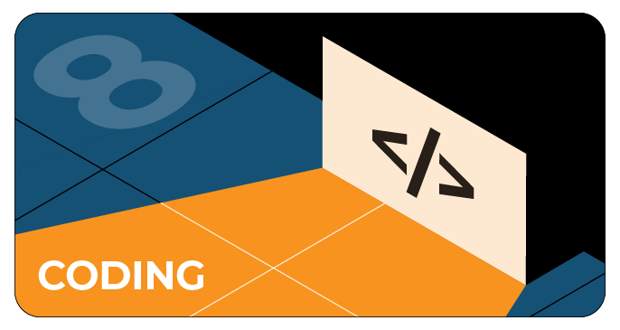

# Задачи на DotNext 2020 Piter

На GitHub мы проведем конкурс для тех, кто хочет покодить. На нашей странице вы найдете восемь задач по количеству направлений в наших конференциях. После решения задачи нужно засабмитить ее в Pull Requests.

Решать задачи можно будет и после конференции: мы будем принимать ответы до 18.00 четверга (18 июня). Победителей мы объявим в пятницу 19 июня. Каждый из них получит промокод на бесплатный Full Pass.

[Ссылка на репозиторий с задачами](https://github.com/JUGRuGroupOnline/DotNextPiter2020)

# Конкурс Top Post

## Top post в Инстаграм
1. Сделать композиционное фото, на котором виден экран монитора или гаджета с трансляцией конференции DotNext. Композиция может быть шуточной, милой, творческой. Пример фото: ноутбук с трансляцией DotNext, а на клавиатуре лежит голова спящего кота и т.д.
2. Учасновить хэштег конференции #янаdotnext
3. Упомянуть профиль JUG Ru Group (@jugrugroup)

Мы определим победителя к концу конференции, т.е 18 июня. Объявление победителя произойдет на закрытии конференции.
Приз: 1 бесплатный билет fullpass!

## Top post в Твиттере
1. В 270 символов уложить свой отзыв об участии в конференции. Отзыв может быть в необычной форме: рифма, шутка, хокку
2. Необходимо отметить аккаунт DotNext и указать хэштег #янаdotnext
3. Можно писать неограниченное количество твитов для победы

Мы определим победителя к концу конференции, т.е 18 июня. Объявление победителя произойдет на закрытии конференции.
Приз: 1 бесплатный билет fullpass!
